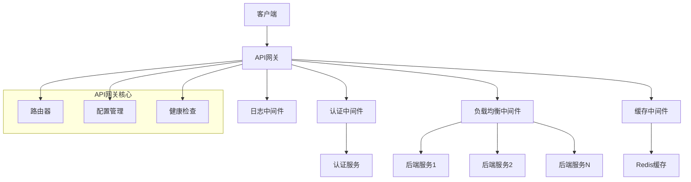

# API网关设计文档

## Overview

本设计文档描述了一个使用Rust构建的高性能API网关系统。该系统采用模块化架构，支持请求路由、认证、负载均衡和缓存等核心功能。系统基于Tokio异步运行时构建，使用Axum作为Web框架，Tower提供中间件支持。

## Architecture

### 系统架构图



### 核心组件

1. **API网关核心**: 负责请求接收、路由分发和响应处理
2. **中间件层**: 提供认证、负载均衡、缓存和日志功能
3. **配置管理**: 动态配置加载和热重载
4. **后端服务**: 简单的HTTP服务器实现
5. **监控和日志**: 系统状态监控和请求追踪

## Components and Interfaces

### 1. API网关核心 (Gateway Core)

```rust
// 主要接口定义
pub struct ApiGateway {
    router: Router,
    config: Arc<RwLock<Config>>,
    middleware_stack: MiddlewareStack,
}

pub trait RequestHandler {
    async fn handle_request(&self, req: Request) -> Result<Response, GatewayError>;
}
```

**职责:**
- HTTP请求接收和响应发送
- 路由规则匹配和请求分发
- 中间件链执行协调
- 错误处理和响应格式化

### 2. 认证中间件 (Authentication Middleware)

```rust
pub struct AuthMiddleware {
    auth_service: Arc<dyn AuthService>,
    config: AuthConfig,
}

pub trait AuthService {
    async fn validate_token(&self, token: &str) -> Result<Claims, AuthError>;
    async fn refresh_token(&self, refresh_token: &str) -> Result<TokenPair, AuthError>;
}
```

**职责:**
- JWT令牌验证
- 用户身份认证
- 权限检查
- 令牌刷新

### 3. 负载均衡中间件 (Load Balancer Middleware)

```rust
pub struct LoadBalancer {
    strategy: Box<dyn LoadBalanceStrategy>,
    health_checker: HealthChecker,
    backends: Arc<RwLock<Vec<Backend>>>,
}

pub trait LoadBalanceStrategy {
    fn select_backend(&self, backends: &[Backend], request: &Request) -> Option<&Backend>;
}
```

**职责:**
- 后端服务发现和管理
- 负载均衡算法实现（轮询、加权轮询、最少连接）
- 健康检查和故障转移
- 连接池管理

### 4. 缓存中间件 (Cache Middleware)

```rust
pub struct CacheMiddleware {
    cache_store: Arc<dyn CacheStore>,
    cache_policy: CachePolicy,
}

pub trait CacheStore {
    async fn get(&self, key: &str) -> Result<Option<CachedResponse>, CacheError>;
    async fn set(&self, key: &str, value: CachedResponse, ttl: Duration) -> Result<(), CacheError>;
    async fn delete(&self, key: &str) -> Result<(), CacheError>;
}
```

**职责:**
- 响应缓存存储和检索
- 缓存键生成和管理
- TTL和缓存策略执行
- 缓存失效和清理

### 5. 配置管理 (Configuration Management)

```rust
pub struct ConfigManager {
    config: Arc<RwLock<GatewayConfig>>,
    file_watcher: FileWatcher,
}

pub struct GatewayConfig {
    pub server: ServerConfig,
    pub routes: Vec<RouteConfig>,
    pub auth: AuthConfig,
    pub load_balancer: LoadBalancerConfig,
    pub cache: CacheConfig,
    pub logging: LoggingConfig,
}
```

**职责:**
- 配置文件解析和验证
- 热重载配置更新
- 配置变更通知
- 默认配置管理

## Data Models

### 请求/响应模型

```rust
pub struct GatewayRequest {
    pub method: Method,
    pub uri: Uri,
    pub headers: HeaderMap,
    pub body: Bytes,
    pub client_ip: IpAddr,
    pub timestamp: SystemTime,
}

pub struct GatewayResponse {
    pub status: StatusCode,
    pub headers: HeaderMap,
    pub body: Bytes,
    pub cache_info: Option<CacheInfo>,
}
```

### 配置模型

```rust
pub struct RouteConfig {
    pub path: String,
    pub method: Option<Method>,
    pub backends: Vec<BackendConfig>,
    pub auth_required: bool,
    pub cache_enabled: bool,
    pub timeout: Duration,
}

pub struct BackendConfig {
    pub url: String,
    pub weight: u32,
    pub health_check_path: Option<String>,
    pub timeout: Duration,
}
```

### 缓存模型

```rust
pub struct CachedResponse {
    pub response: GatewayResponse,
    pub created_at: SystemTime,
    pub ttl: Duration,
    pub cache_key: String,
}
```

## Error Handling

### 错误类型定义

```rust
#[derive(Debug, thiserror::Error)]
pub enum GatewayError {
    #[error("Authentication failed: {0}")]
    AuthenticationFailed(String),
    
    #[error("Backend service unavailable")]
    BackendUnavailable,
    
    #[error("Request timeout")]
    RequestTimeout,
    
    #[error("Cache error: {0}")]
    CacheError(#[from] CacheError),
    
    #[error("Configuration error: {0}")]
    ConfigError(String),
    
    #[error("Internal server error: {0}")]
    InternalError(String),
}
```

### 错误处理策略

1. **认证错误**: 返回401状态码，记录安全日志
2. **后端不可用**: 返回503状态码，触发健康检查
3. **超时错误**: 返回504状态码，记录性能指标
4. **缓存错误**: 降级到直接请求后端，记录警告日志
5. **配置错误**: 使用默认配置，记录错误日志

## Testing Strategy

### 单元测试

- **组件测试**: 每个中间件和核心组件的独立测试
- **Mock测试**: 使用Mock对象测试外部依赖
- **错误场景测试**: 各种错误条件的处理测试

### 集成测试

- **端到端测试**: 完整请求流程的集成测试
- **中间件集成**: 多个中间件协同工作的测试
- **配置测试**: 不同配置场景的功能测试

### 性能测试

- **负载测试**: 高并发请求处理能力测试
- **压力测试**: 系统极限负载下的稳定性测试
- **缓存性能**: 缓存命中率和响应时间测试

### 测试工具和框架

- **单元测试**: Rust内置测试框架 + mockall
- **集成测试**: testcontainers-rs用于Redis等外部服务
- **性能测试**: criterion.rs用于基准测试
- **端到端测试**: reqwest客户端进行HTTP测试

## 技术栈选择

### 核心依赖

- **tokio**: 异步运行时，提供高性能异步I/O
- **axum**: 现代Web框架，基于hyper和tower
- **tower**: 中间件生态系统，提供丰富的中间件支持
- **serde**: 序列化/反序列化，用于配置和数据处理
- **tracing**: 结构化日志和分布式追踪

### 存储和缓存

- **redis**: 高性能缓存存储
- **sqlx**: 可选的数据库连接（用于认证服务）

### 配置和监控

- **config**: 配置文件管理
- **notify**: 文件系统监控，支持配置热重载
- **metrics**: 指标收集和监控
- **prometheus**: 指标导出（可选）

### 开发和测试

- **thiserror**: 错误处理
- **anyhow**: 错误传播
- **mockall**: Mock测试框架
- **testcontainers**: 集成测试容器支持